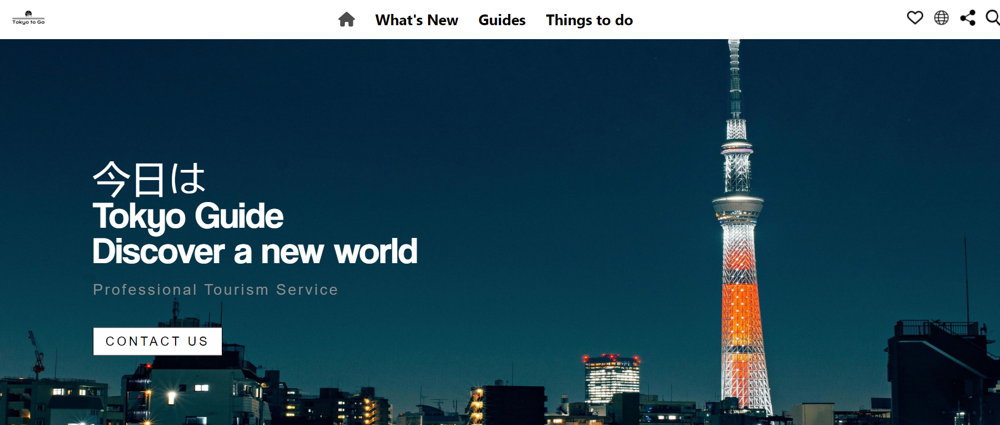

<!-- Improved compatibility of back to top link: See: https://github.com/othneildrew/Best-README-Template/pull/73 -->
<a name="readme-top"></a>
<!--
*** Thanks for checking out the Best-README-Template. If you have a suggestion
*** that would make this better, please fork the repo and create a pull request
*** or simply open an issue with the tag "enhancement".
*** Don't forget to give the project a star!
*** Thanks again! Now go create something AMAZING! :D
-->


<!-- PROJECT SHIELDS -->
<!--
*** I'm using markdown "reference style" links for readability.
*** Reference links are enclosed in brackets [ ] instead of parentheses ( ).
*** See the bottom of this document for the declaration of the reference variables
*** for contributors-url, forks-url, etc. This is an optional, concise syntax you may use.
*** https://www.markdownguide.org/basic-syntax/#reference-style-links
-->
[![Contributors][contributors-shield]][contributors-url]
[![Forks][forks-shield]][forks-url]
[![Stargazers][stars-shield]][stars-url]
[![Issues][issues-shield]][issues-url]
[![LinkedIn][linkedin-shield]][linkedin-url]


<!-- PROJECT LOGO -->
<br />
<div align="center">
<!--   <a href="https://github.com/othneildrew/Best-README-Template](https://github.com/RayFFH/TouristAgencyWebsite/blob/main/README.md)">
     -->
  </a>

  <h3 align="center">TouristAgencyWebsite</h3>

  <p align="center">
    Frontend design for tourist agency located in Tokyo
    <br />
    <a href="https://rayffh.github.io/TouristAgencyWebsite/"><strong>Explore the docs »</strong></a>
    <br />
    <br />
    <a href="https://github.com/RayFFH/TouristAgencyWebsite">View Demo</a>
    ·
    <a href="https://github.com/RayFFH/TouristAgencyWebsite/issues">Report Bug</a>
    ·
    <a href="https://github.com/RayFFH/TouristAgencyWebsite/issues">Request Feature</a>
  </p>
</div>



<!-- TABLE OF CONTENTS -->
<details>
  <summary>Table of Contents</summary>
  <ol>
    <li>
      <a href="#about-the-project">About The Project</a>
      <ul>
        <li><a href="#built-with">Built With</a></li>
      </ul>
    </li>
    <li>
      <a href="#getting-started">Getting Started</a>
      <ul>
        <li><a href="#prerequisites">Prerequisites</a></li>
        <li><a href="#installation">Installation</a></li>
      </ul>
    </li>
    <li><a href="#usage">Usage</a></li>
    <li><a href="#roadmap">Roadmap</a></li>
    <li><a href="#contributing">Contributing</a></li>
    <li><a href="#license">License</a></li>
    <li><a href="#contact">Contact</a></li>
    <li><a href="#acknowledgments">Acknowledgments</a></li>
  </ol>
</details>


<!-- ABOUT THE PROJECT -->
## About The Project

Front end for website focused on tourism in Tokyo

Couple features:
* Carousel of events happening in tokyo
* Switches to hamburger icon when accessing through a phone

Access the website through this link below:
https://rayffh.github.io/TouristAgencyWebsite/

<p align="right">(<a href="#readme-top">back to top</a>)</p>


### Built With

This section should list any major frameworks/libraries used to bootstrap your project. Leave any add-ons/plugins for the acknowledgements section. Here are a few examples.

* [![React][React.js]][React-url]
* [![JQuery][JQuery.com]][JQuery-url]
* 
* 

<p align="right">(<a href="#readme-top">back to top</a>)</p>


<!-- GETTING STARTED -->
## Getting Started

This is an example of how you may give instructions on setting up your project locally.
To get a local copy up and running follow these simple example steps.

### Prerequisites

To run the website locally
  ```
  npm run build
  ```
  ```
  npm start
  ```

### Installation

1. Clone the repo
   ```sh
   git clone https://github.com/your_username_/Project-Name.git
   ```
2. Install NPM packages
   ```sh
   npm install
   ```
3. Run the build
   ```js
   npm start
   ```

<p align="right">(<a href="#readme-top">back to top</a>)</p>


<!-- USAGE EXAMPLES -->
## Usage

 ```
const root = ReactDOM.createRoot(document.getElementById('root'));
root.render(
  <React.StrictMode>
    <HashRouter>
    <App />
    </HashRouter>
  </React.StrictMode>
);
 ```
If you want to use this as a template and deploy your own webapp make sure to use HashRouter instead of BrowserRouter when deploying.

<p align="right">(<a href="#readme-top">back to top</a>)</p>

<!-- ROADMAP -->
## Roadmap

- [x] Add Changelog
- [x] Add back to top links
- [x] Finish basic template for website
- [ ] Finish HomePage
- [ ] Add What's New Page to website
- [ ] Add search function
- [ ] Allowing Tabbing for visually impaired users
- [ ] Multi-language Support
    - [ ] Chinese
    - [ ] Spanish

See the [open issues](https://github.com/RayFFH/TouristAgencyWebsite/issues) for a full list of proposed features (and known issues).

<p align="right">(<a href="#readme-top">back to top</a>)</p>


<!-- CONTRIBUTING -->
## Contributing

If you have a suggestion that would make this better, please fork the repo and create a pull request. Also you can email me at phoenix222smart@gmail.com.

1. Fork the Project
2. Create your Feature Branch (`git checkout -b feature`)
3. Commit your Changes (`git commit -m 'Add some feature'`)
4. Push to the Branch (`git push origin feature`)
5. Open a Pull Request

<p align="right">(<a href="#readme-top">back to top</a>)</p>

<!-- CONTACT -->
## Contact

email - phoenix222smart@gmail.com

github - https://www.linkedin.com/in/phoenixsmart/

<p align="right">(<a href="#readme-top">back to top</a>)</p>


<!-- MARKDOWN LINKS & IMAGES -->
<!-- https://www.markdownguide.org/basic-syntax/#reference-style-links -->
[contributors-shield]: https://img.shields.io/github/contributors/RayFFH/TouristAgencyWebsite?style=for-the-badge
[contributors-url]: https://github.com/RayFFH/TouristAgencyWebsite/graphs/contributors
[forks-shield]: https://img.shields.io/github/forks/RayFFH/TouristAgencyWebsite?style=for-the-badge
[forks-url]: https://github.com/RayFFH/TouristAgencyWebsite/network/members
[stars-shield]: https://img.shields.io/github/stars/RayFFH/TouristAgencyWebsite?style=for-the-badge
[stars-url]: https://github.com/RayFFH/TouristAgencyWebsite/stargazers
[issues-shield]: https://img.shields.io/github/issues/RayFFH/TouristAgencyWebsite.svg?style=for-the-badge
[issues-url]: https://github.com/RayFFH/TouristAgencyWebsite/issues
[linkedin-shield]: https://img.shields.io/badge/-LinkedIn-black.svg?style=for-the-badge&logo=linkedin&colorB=555
[linkedin-url]: https://linkedin.com/in/phoenixsmart
[product-screenshot]: images/screenshot.png
[Next.js]: https://img.shields.io/badge/next.js-000000?style=for-the-badge&logo=nextdotjs&logoColor=white
[Next-url]: https://nextjs.org/
[React.js]: https://img.shields.io/badge/React-20232A?style=for-the-badge&logo=react&logoColor=61DAFB
[React-url]: https://reactjs.org/
[Vue.js]: https://img.shields.io/badge/Vue.js-35495E?style=for-the-badge&logo=vuedotjs&logoColor=4FC08D
[Vue-url]: https://vuejs.org/
[Angular.io]: https://img.shields.io/badge/Angular-DD0031?style=for-the-badge&logo=angular&logoColor=white
[Angular-url]: https://angular.io/
[Svelte.dev]: https://img.shields.io/badge/Svelte-4A4A55?style=for-the-badge&logo=svelte&logoColor=FF3E00
[Svelte-url]: https://svelte.dev/
[Laravel.com]: https://img.shields.io/badge/Laravel-FF2D20?style=for-the-badge&logo=laravel&logoColor=white
[Laravel-url]: https://laravel.com
[Bootstrap.com]: https://img.shields.io/badge/Bootstrap-563D7C?style=for-the-badge&logo=bootstrap&logoColor=white
[Bootstrap-url]: https://getbootstrap.com
[JQuery.com]: https://img.shields.io/badge/jQuery-0769AD?style=for-the-badge&logo=jquery&logoColor=white
[JQuery-url]: https://jquery.com 
